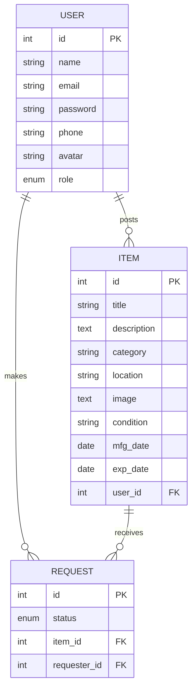

# ReValue Hub — Final Year Project Report

---

## 1. Title Page

**Project Title:** ReValue Hub — A Community Reuse Marketplace

**Author:** *[Your Name]*

**Institution:** *[Your Institution]*

**Date:** *[Submission Date]*

**Degree:** Bachelor of Science in Computer Science / Software Engineering *(adjust as needed)*

**Supervisor:** *[Supervisor Name]*

---

## 2. Abstract

ReValue Hub is a web-based community reuse marketplace that enables individuals to donate, browse, and request pre-owned items within a local neighborhood. The platform addresses the growing problem of household waste by providing a digital infrastructure for peer-to-peer item reuse, effectively extending the lifecycle of goods that would otherwise be discarded.

The system is built on a dual-backend architecture: a primary Node.js/Express REST API using Sequelize ORM connected to a MariaDB database, and a legacy PHP API for additional service endpoints. The frontend consists of static HTML pages styled with Tailwind CSS, served directly by Express, with dynamic behavior implemented via vanilla JavaScript. Authentication is handled through JSON Web Tokens (JWT) with bcrypt password hashing, and role-based access control differentiates between regular users and administrators.

Key features include user registration and authentication, item listing with image uploads, search and category-based browsing, item request management with approval/rejection workflows, peer-to-peer messaging, a user dashboard for tracking donations and requests, and an administrative dashboard for moderation and system oversight. The system was validated through a structured test plan covering 70 test cases across authentication, item management, request handling, admin operations, messaging, and edge-case error handling.

---

## 3. Introduction

### 3.1 Problem Statement

Modern consumption patterns generate a large volume of reusable goods that are prematurely discarded. Many individuals and communities lack a simple, secure platform to offer these items to others, leading to avoidable waste. Key issues addressed by this project include:

- **Lack of centralized local systems** for sharing or requesting used items within a community.
- **Poor management of item requests and verification** for shared goods, leading to trust and coordination challenges.
- **Insufficient support for both regular users and administrators** in item lifecycle tracking.
- **Absence of an integrated database design** to manage users, listings, and requests efficiently.

### 3.2 Aim

To design and implement ReValue Hub, a secure community platform for listing reusable items, managing requests, and facilitating reuse through a robust database-backed web application.

### 3.3 Objectives

1. Build a user authentication system with role-based access for regular users and administrators.
2. Implement item posting, browsing, and search/filter functionality for reusable goods.
3. Enable request creation, tracking, and approval/rejection workflows.
4. Develop an administrative dashboard for monitoring users, items, and requests.
5. Create a relational database schema with clear entity relationships and persistence using MariaDB and Sequelize.
6. Validate the solution through structured testing covering 70 test cases.

### 3.4 Scope

ReValue Hub is a full-stack web application encompassing:

- **Backend:** Node.js/Express REST API (primary) and a PHP API (legacy, secondary).
- **Frontend:** Static HTML pages with Tailwind CSS styling and vanilla JavaScript interactivity.
- **Database:** MySQL/MariaDB with Sequelize ORM for the Express backend.
- **Authentication:** JWT-based with bcrypt password hashing and role-based access control.
- **File Storage:** Server-side image uploads for item photos and user avatars.

The following are out of scope for this report:

- Social login providers (Google, Facebook) — UI buttons exist but backend is not fully wired.
- Real-time messaging via WebSockets (the messages page uses poll-based updates).
- Email/SMS notification delivery (notifications are database-only).
- Mobile native applications (the system is browser-based with responsive design).
- Legacy PHP API endpoints not mounted by `server.js`.

---

## 4. Literature Review

> **TODO — This section is to be filled manually by the author.**
>
> Suggested areas to research:
> - Sharing economy platforms and peer-to-peer reuse marketplaces.
> - Circular economy principles and waste reduction through digital platforms.
> - Trust and reputation systems in community exchange platforms.
> - Database normalization and ORM patterns for user-generated content.
> - JWT authentication patterns and security considerations in web applications.
> - Comparison of existing platforms (Freecycle, Olio, Buy Nothing Project, Facebook Marketplace).

---

## 5. System Analysis & Requirements

### 5.1 User Roles

| Role | Description | Capabilities |
|------|-------------|-------------|
| **Guest** | Unregistered visitor | View landing page, browse items, view item details, view informational pages. Cannot list, request, message, or access dashboards. |
| **Registered User** | Authenticated account holder | Create/view/delete own items, request items (except own), approve/reject requests on own items, send/receive messages, update profile, view personal dashboard. |
| **Administrator** | User with `role: 'admin'` | All user capabilities plus: access admin dashboard with system stats, view all users/items/requests, delete any user or item, approve/reject pending items, manage volunteer applications, invite new admins. |

### 5.2 Functional Requirements

The following functional requirements were identified and implemented (derived from SRS.md):

| ID | Feature | Description |
|----|---------|-------------|
| FR-01 | User Registration | Guest creates account with name, email, password (min 6 chars, valid email format). |
| FR-02 | User Login | Registered user authenticates with email + password, receives JWT (30-day expiry). |
| FR-03 | Browse Items | All visitors can list items with search (title LIKE), category filter, location filter. |
| FR-04 | View Item Details | Full item view with images, description, donor info, condition, location map. |
| FR-05 | Request an Item | Authenticated user can request another user's item (blocked for own items and duplicates). |
| FR-06 | Send Message | Authenticated user can message another user, with auto-polling inbox (3-second interval). |
| FR-07 | List/Donate an Item | Create item with title, description, category, photos (up to 10 images, 10MB max), location. |
| FR-08 | Manage Own Items | View own listings on dashboard, delete own items (or admin can delete any). |
| FR-09 | Profile Management | Update name, email, and avatar photo. |
| FR-10 | Notifications | Database-stored notifications for messages, item requests, and volunteer status changes. |
| FR-11 | Admin Item Approval | Admin can approve/reject/delete pending items. |
| FR-12 | Admin User Management | Admin can view all users and delete users from the system. |
| FR-13 | Admin Statistics | Admin dashboard shows counts of users, items, requests, and impact metrics. |
| FR-14 | Volunteer Applications | Users can submit volunteer applications; admins can approve/reject. |
| FR-15 | Invite Administrator | Existing admin can invite new admins via email (must contain "admin"). |

### 5.3 Non-Functional Requirements

| Category | Requirement | Implementation |
|----------|-------------|---------------|
| Security | NFR-SEC-01: JWT Authentication | JWT with 30-day expiry, verified via `protect` middleware. |
| Security | NFR-SEC-02: Password Hashing | bcrypt with 12 salt rounds via `beforeCreate` hook in User model. |
| Security | NFR-SEC-03: Role-Based Access | `restrictTo('admin')` middleware; owner-only delete checks in `deleteItem`. |
| Security | NFR-SEC-04: Input Validation | Server-side validation for email format, password length, required fields. |
| Security | NFR-SEC-05: File Upload Restrictions | Multer limits: items 10MB/image (max 10 images), avatars 5MB. Only JPEG/PNG/WebP/GIF. |
| Performance | NFR-PERF-01: Message Polling | `setInterval(pollInboxAndActiveThread, 3000)` for near-real-time chat. |
| Usability | NFR-UI-01: Responsive Design | Tailwind CSS responsive grid utilities across all pages. |
| Usability | NFR-UI-02: Dark Mode | Admin dashboard dark mode toggle via `class="dark"` on `<html>`. |
| Usability | NFR-UI-03: Client-Side Validation | Frontend form validation (required fields, terms checkbox, medicine field toggle). |
| Usability | NFR-UI-04: Drag-and-Drop Uploads | Item listing form supports drag-and-drop image upload with preview grid. |
| Availability | NFR-AVAIL-01: Graceful Degradation | Server continues running if DB fails; static pages remain accessible. |
| Availability | NFR-AVAIL-02: Auto DB Creation | `CREATE DATABASE IF NOT EXISTS` on startup; `sequelize.sync({ alter: true })`. |

---

## 6. System Design

### 6.1 System Architecture

ReValue Hub follows a three-tier client-server architecture:

```
┌───────────────────────────────────────────────────┐
│                   Client Layer                     │
│  ┌─────────────┐  ┌───────────┐  ┌─────────────┐ │
│  │ HTML Pages   │  │ Tailwind  │  │ Vanilla JS  │ │
│  │ (Static)     │  │ CSS (CDN) │  │ (app.js)    │ │
│  └─────────────┘  └───────────┘  └──────┬──────┘ │
│                                          │        │
│                         fetch() / apiRequest()    │
└──────────────────────────────┬───────────┬────────┘
                               │           │
┌──────────────────────────────┴───────────┴────────┐
│                   Server Layer                     │
│  ┌─────────────────────┐  ┌─────────────────────┐ │
│  │  Express API (Port  │  │  PHP API (Legacy,   │ │
│  │  3000)              │  │  via Apache)        │ │
│  │  /api/auth/*        │  │  /api/*.php         │ │
│  │  /api/items/*       │  │                     │ │
│  │  /api/requests/*    │  │                     │ │
│  │  /api/admin/*       │  │                     │ │
│  │  Static File Server │  │                     │ │
│  └────────┬────────────┘  └────────┬────────────┘ │
│           │                        │              │
└───────────┼────────────────────────┼──────────────┘
            │                        │
┌───────────┴────────────────────────┴──────────────┐
│                 Data Layer                         │
│  ┌──────────────────────────────────────────────┐ │
│  │  MySQL / MariaDB Database                     │ │
│  │  Tables: users, posts (items), requests,      │ │
│  │  messages, notifications,                     │ │
│  │  volunteer_applications                       │ │
│  └──────────────────────────────────────────────┘ │
└───────────────────────────────────────────────────┘
```

### 6.2 Entity-Relationship Diagram

The database schema defines three core entities managed by the Express/Sequelize backend, plus auxiliary tables (messages, notifications, volunteer_applications) handled by the PHP backend.

```
┌──────────┐       ┌──────────┐       ┌──────────┐
│   User   │       │   Item   │       │  Request │
├──────────┤       ├──────────┤       ├──────────┤
│ id (PK)  │◄──────│ user_id  │       │ id (PK)  │
│ name     │  1:N  │ (FK)     │       │ item_id  │
│ email    │       │ id (PK)  │◄──────│ (FK)     │
│ password │       │ title    │  1:N  │ requester│
│ phone    │       │ desc.    │       │ _id (FK) │
│ avatar   │       │ category │       │ status   │
│ role     │       │ location │       │ created  │
│ created  │       │ image[]  │       │ _at      │
└────┬─────┘       │ cond.    │       └──────────┘
     │             │ mfgDate  │
     │  1:N        │ expDate  │
     ├────────────►│ created  │
     │ "requests"  │ _at      │
     │             └──────────┘
     │
     │  1:N
     ├────────────► "messages" table (PHP)
     │
     ├────────────► "notifications" table (PHP)
     │
     └────────────► "volunteer_applications" table (PHP)
```

The Mermaid ERD from `FYP_PROPOSAL.md`:



> **Note:** An ERD Word document or exported PNG can be placed here if available. The current project root does not contain a standalone ERD file; the schema is defined in `models/User.js`, `models/Item.js`, and `models/Request.js` for the Express backend, and in `schema.sql` for the PHP backend.

### 6.3 Technology Stack

| Layer | Technology | Version | Purpose |
|-------|-----------|---------|---------|
| **Runtime** | Node.js | >= 18.0.0 | JavaScript runtime for Express server |
| **Web Framework** | Express | ^4.19.2 | REST API routing and middleware |
| **ORM** | Sequelize | ^6.37.8 | Database modeling and query interface |
| **Database** | MySQL / MariaDB | 8+ with InnoDB | Relational data storage |
| **Database Driver** | mysql2 | ^3.22.3 | MariaDB connection driver |
| **Auth** | jsonwebtoken | ^9.0.2 | JWT signing and verification |
| **Password Hashing** | bcryptjs | ^2.4.3 | Secure password hashing (12 rounds) |
| **File Uploads** | multer | ^1.4.5-lts.1 | Multipart form data and image storage |
| **CORS** | cors | ^2.8.5 | Cross-Origin Resource Sharing |
| **Environment** | dotenv | ^16.4.5 | Configuration via `.env` file |
| **CSS Framework** | Tailwind CSS | 3.x (CDN) | Utility-first responsive styles |
| **Icons** | Material Symbols | CDN | Icon library for UI |
| **Typography** | Manrope (Google Fonts) | CDN | UI font family |
| **Dev Tool** | nodemon | ^3.1.4 | Auto-restart during development |

### 6.4 Database Schema Details

The Express/Sequelize ORM defines three models that are synced to the `revaluehub` database via `sequelize.sync({ alter: true })`:

#### User Model (`models/User.js`)
- Table name: `users` (underscored: true)
- Fields: `id` (PK, auto-increment), `name` (string, required), `email` (string, required, unique), `password` (string, required, auto-hashed via `beforeCreate` hook with bcrypt 12 rounds), `phone` (string, nullable), `avatar` (string, nullable), `role` (enum: 'user', 'admin', default: 'user')
- Relationships: `User.hasMany(Item)`, `User.hasMany(Request)`

#### Item Model (`models/Item.js`)
- Table name: `posts` (underscored: true)
- Fields: `id` (PK), `title` (string, required), `description` (text, required), `category` (string, required), `location` (string, required), `image` (text — JSON array stored as string, getter parses to array, setter stringifies), `condition` (string, default 'good'), `mfgDate` (date, nullable), `expDate` (date, nullable), `user_id` (FK to users)
- Relationships: `Item.belongsTo(User)`, `Item.hasMany(Request)`

#### Request Model (`models/Request.js`)
- Table name: `requests` (underscored: true)
- Fields: `id` (PK), `status` (enum: 'pending', 'approved', 'rejected', default: 'pending'), `item_id` (FK to posts), `requester_id` (FK to users)
- Relationships: `Request.belongsTo(Item)`, `Request.belongsTo(User)`

---

## 7. Implementation

### 7.1 Project Structure

```
ReValueHub/
├── server.js                  # Express server entry point
├── package.json               # Node dependencies and scripts
├── .env                       # Environment configuration
├── middleware/
│   └── auth.js                # JWT protect & restrictTo middleware
├── routes/
│   ├── auth.js                # Auth routes (register, login, logout, me, profile)
│   ├── items.js               # Item routes (CRUD with image upload)
│   ├── requests.js            # Request routes (CRUD with status update)
│   └── admin.js               # Admin routes (users, stats) — all require admin role
├── controllers/
│   ├── authController.js      # Auth logic (register, login, getMe, updateProfile, logout)
│   ├── itemController.js      # Item logic (CRUD, search/filter, ownership checks)
│   ├── requestController.js   # Request logic (create, list, status update, ownership checks)
│   └── adminController.js     # Admin logic (list users, delete user, stats)
├── models/
│   ├── db.js                  # Sequelize database connection
│   ├── User.js                # User model with bcrypt hooks
│   ├── Item.js                # Item model with JSON image field
│   └── Request.js             # Request model with status enum
├── seeders/
│   └── seed.js                # Demo data seeding (3 users, sample items)
├── uploads/                   # Uploaded images directory
├── assets/                    # Static assets (logo, favicon)
├── js/
│   ├── app.js                 # Main frontend JavaScript (auth, items, dashboard, messages)
│   └── admin-dashboard.js     # Admin dashboard JavaScript
├── *.html                     # All static frontend pages
├── api/                       # Legacy PHP API (not mounted by server.js)
├── FYP_PROPOSAL.md            # Project proposal document
├── SRS.md                     # Software Requirements Specification
├── DESIGN.md                  # Design system (colors, typography, spacing)
├── DATABASE_SETUP.md          # Database setup instructions
├── API_DOCUMENTATION.md       # REST API reference
├── TEST_PLAN.md               # Test plan with 70 test cases
└── USER_MANUAL.md             # End-user manual
```

### 7.2 Server Entry Point (`server.js`)

The Express server performs the following on startup:

1. Loads environment variables via `dotenv.config()`.
2. Initializes middleware: CORS, JSON body parser, URL-encoded parser.
3. Creates the `uploads/` directory if it does not exist.
4. Serves static files from the project root and the `uploads/` directory.
5. Connects to MariaDB, auto-creates the database if missing, authenticates, and syncs tables with `{ alter: true }`.
6. Seeds demo data via `seeders/seed.js` if the database is empty.
7. Mounts route groups:
   - `/api/auth` → `routes/auth.js`
   - `/api/items` → `routes/items.js`
   - `/api/requests` → `routes/requests.js`
   - `/api/admin` → `routes/admin.js`
8. Mounts legacy root-level routes for backward compatibility:
   - `POST /register`, `POST /login`, `POST /logout`
   - `POST /create-post`, `GET /get-posts`, `GET /get-post/:id`, `DELETE /delete-post/:id`
   - `POST /request-item`
9. Defines a catch-all 404 handler that serves `landing.html`.
10. Listens on the configured port (default 3000).

### 7.3 Authentication Middleware (`middleware/auth.js`)

```javascript
// protect middleware: extracts Bearer token, verifies JWT, loads user
exports.protect = async (req, res, next) => {
    const token = req.headers.authorization?.split(' ')[1];
    if (!token) return res.status(401).json({ status: 'fail', message: 'You are not logged in!' });
    const decoded = jwt.verify(token, process.env.JWT_SECRET);
    req.user = await User.findByPk(decoded.id);
    if (!req.user) return res.status(401).json({ status: 'fail', message: 'The user no longer exists.' });
    next();
};

// restrictTo middleware: checks req.user.role against allowed roles
exports.restrictTo = (...roles) => {
    return (req, res, next) => {
        if (!roles.includes(req.user.role)) {
            return res.status(403).json({ status: 'fail', message: 'You do not have permission' });
        }
        next();
    };
};
```

### 7.4 Route Groups

#### Auth Routes (`routes/auth.js`)
- `POST /register` — Public registration with name, email, password validation.
- `POST /login` — Public login with credential verification.
- `POST /logout` — Public stateless logout.
- `GET /me` — Protected: returns current user's profile.
- `PUT /profile` — Protected, multipart: updates name, email, phone, avatar image (5MB limit, JPEG/PNG/WebP/GIF only).

#### Items Routes (`routes/items.js`)
- `GET /` — Public: lists items with optional `search`, `category`, `location`, `limit` query filters.
- `GET /user` — Protected: lists current user's own items.
- `GET /:id` — Public: returns single item with donor info.
- `POST /` — Protected, multipart: creates item with up to 10 images (10MB each, JPEG/PNG/WebP/GIF).
- `DELETE /:id` — Protected: deletes item (owner or admin only).

#### Requests Routes (`routes/requests.js`)
- `POST /` — Protected: creates request for an item (validates: item exists, not own item, no duplicate).
- `GET /user` — Protected: lists current user's requests with item and donor info.
- `GET /item/:itemId` — Protected: lists requests for a specific item.
- `PATCH /:id` — Protected: updates request status (item owner only; validates ownership).

#### Admin Routes (`routes/admin.js`)
- All routes use `protect` + `restrictTo('admin')` middleware.
- `GET /users` — Lists all users (id, name, email, role, created_at).
- `DELETE /users/:id` — Deletes a user by ID.
- `GET /stats` — Returns aggregate counts `{ users, items, requests }`.

### 7.5 Frontend Pages

| Page | File | Purpose |
|------|------|---------|
| Landing | `landing.html` | Hero section, categories, featured items, CTAs |
| Register | `register.html` | Account creation form (name, email, password, terms checkbox) |
| Login | `login.html` | Sign-in form with email/password |
| Browse | `browse.html` | Item grid with sidebar category filters and search |
| Item Detail | `item-detail.html` | Full item view with request/message/edit buttons |
| List Item | `list-item.html` | Multi-step donation form with image upload |
| Dashboard | `dashboard.html` | User dashboard with My Donations, My Requests, History, Settings |
| Messages | `messages.html` | Split-view inbox with conversation list and chat pane |
| Profile | `profile.html` | Public user profile page with avatar and active listings |
| Admin Dashboard | `admin-dashboard.html` | Admin panel with stats, pending items, user/item/request management, settings |
| Informational | `how_it_works.html`, `mission_page.html`, `about_us.html`, `contact_us.html`, `help_center.html`, `terms_of_service.html`, `privacy_policy.html`, `community_guidelines.html`, `safety_center.html`, `report_an_issue.html`, `become_a_volunteer.html` | Static content pages |

### 7.6 Key Frontend Behaviors (`js/app.js`)

- **Authentication flow:** Checks for token in `localStorage`, calls `GET /api/auth/me` to validate, updates UI with `updateUI()`.
- **Guest redirect:** Users accessing protected pages without a token are redirected to `register.html` with the original URL saved in `postAuthRedirect` for return after registration.
- **Item card interaction:** Click delegation on item grids navigates to `item-detail.html?id=N`.
- **Message polling:** Inbox polls every 3 seconds via `setInterval(pollInboxAndActiveThread, 3000)`.
- **Notification polling:** Checks for new notifications every 30 seconds; displays toast for new messages.
- **Profile avatar:** Uploads via FileReader for instant preview, then sends to `PUT /api/auth/profile`.

---

## 8. Testing

### 8.1 Test Plan Overview

A comprehensive test plan was developed and documented in `TEST_PLAN.md`, covering **70 test cases** across six feature groups. The actual result and status columns are left blank for manual test execution.

### 8.2 Test Environment

| Component | Requirement |
|-----------|-------------|
| Node.js | >= 18.0.0 |
| Database | MySQL or MariaDB (via `.env`) |
| Server | Express on `http://localhost:3000` |
| Browser | Chrome / Firefox / Edge (latest) |
| API Client | `curl`, Postman, or DevTools |

### 8.3 Test Case Summary

| Feature Group | Test Cases | IDs |
|--------------|-----------|-----|
| Authentication & Authorization | 18 | TC-01 to TC-18 |
| Items (Donations) | 18 | TC-19 to TC-36 |
| Requests | 11 | TC-37 to TC-47 |
| Admin | 9 | TC-48 to TC-56 |
| Messages | 6 | TC-57 to TC-62 |
| Edge Cases & Error Handling | 8 | TC-63 to TC-70 |
| **Total** | **70** | |

### 8.4 Key Validation Rules Tested

1. **Auth:** Email format regex validation, password minimum length (6 chars), required field checks, duplicate email prevention, invalid credential rejection.
2. **Items:** Required field enforcement (title, description, category, location), owner-only delete restriction, admin override for deleting any item, 404 handling for missing items.
3. **Requests:** Cannot request own item (400 blocked), cannot duplicate request (400 blocked), item-owner-only status update (403 for non-owners), 404 for non-existent items or requests.
4. **Admin:** Role-based guard rejecting non-admin users (403), unauthenticated requests (401), user deletion, stats aggregation.
5. **Frontend:** Guest redirects to register for protected pages, logged-in users redirected away from auth pages, avatar upload preview, file type/size limits via Multer.

### 8.5 Example Test Cases

| ID | Feature | Precondition | Test Steps | Expected Result |
|----|---------|-------------|-----------|----------------|
| TC-01 | Register — valid | No user logged in | Fill name, email, password on register.html → submit | 201 with token + user; redirected to dashboard |
| TC-06 | Login — valid | User exists | Enter valid email/password on login.html → submit | 200 with token + user; redirected to dashboard |
| TC-31 | Delete item — not owner | User A, item of user B | DELETE /api/items/:id-of-B with A's token | 403 "Unauthorized" |
| TC-38 | Request own item | Authenticated user viewing own item | POST /api/requests with own item_id | 400 "You cannot request your own item" |
| TC-44 | Approve request | Item owner | PATCH /api/requests/:id with status "approved" | 200, status changed to "approved" |
| TC-48 | Admin get users | Admin logged in | GET /api/admin/users with admin token | 200 with user array (no passwords) |
| TC-63 | Invalid file type | Authenticated user | Upload .txt file to POST /api/items | Multer rejection |

---

## 9. User Guide

*This section is condensed from `USER_MANUAL.md`. For the full illustrated guide, see `USER_MANUAL.md`.*

### 9.1 Getting Started

1. Open `http://localhost:3000` in a browser.
2. Click **Create Free Account** to register (or **Sign In** if you already have an account).
3. Fill in your name, email, and password (minimum 6 characters), agree to the terms, and submit.

### 9.2 Browsing Items

1. Click **Browse** in the top navigation bar.
2. Items appear as cards in a grid. Use the search box to find items by keyword.
3. Use the left sidebar to filter by category (Furniture, Electronics, Tools, etc.).
4. Click any item card to view its full details.

### 9.3 Donating an Item

1. Click the **Donate** button in the header.
2. Fill in the item title, select a category, and write a description.
3. Upload photos (up to 10 images, JPEG/PNG/WebP/GIF, max 10MB each).
4. Enter a pickup location and click **Publish Listing**.

### 9.4 Requesting an Item

1. Open an item's detail page.
2. Click the blue **Request Item** button.
3. The donor will see your request and can approve or reject it.
4. You cannot request your own items or request the same item twice.

### 9.5 Messaging

1. On an item detail page, click **Message Donor** to open a conversation.
2. Use the Messages page (`messages.html`) to view all conversations and reply.
3. New messages appear every few seconds via auto-polling.

### 9.6 Managing Your Account

1. Go to your Dashboard (`dashboard.html`) to see your donations, requests, and activity history.
2. Click **Settings** in the sidebar to update your name, email, or profile picture.
3. Click **Logout** to sign out.

### 9.7 Visual References

Screenshots available in the project root:
- `Landing page.png` — Home page
- `Regester page.png` — Registration form
- `Login page.png` — Login form
- `Browse items.png` — Item browsing with filters
- `Item detail.png` — Item detail view
- `List new item.png` — Donation/listing form
- `User dashboard.png` — User dashboard
- `Admin dashboard.png` — Admin dashboard

---

## 10. Conclusion & Future Work

### 10.1 Conclusion

ReValue Hub successfully delivers a functional community reuse marketplace that addresses the core problem of household waste through digital peer-to-peer exchange. The system implements all primary objectives:

- A secure JWT-based authentication system with role-based access control.
- Full item lifecycle management — listing, browsing (with search/filter), and deletion.
- Request management with approval/rejection workflows and ownership validation.
- An administrative dashboard for user and item moderation.
- A normalized relational database schema (User → Item → Request) using Sequelize ORM with MariaDB.
- A structured test plan with 70 test cases covering all functional areas.

The project demonstrates a practical application of the MVC architectural pattern, REST API design principles, secure authentication practices, and responsive frontend development using vanilla JavaScript and Tailwind CSS.

### 10.2 Limitations

- The dual-backend architecture (Express + PHP) creates parallel authentication systems whose tokens do not cross-authenticate.
- The PHP API uses non-cryptographic "dummy tokens" that are inherently insecure.
- There is no email or SMS notification delivery; all notifications are database-only.
- Real-time messaging is implemented via polling (3-second intervals) rather than WebSockets.
- Social login buttons exist in the UI but the backend endpoint is not fully implemented.
- Image uploads lack server-side compression or resizing.
- There is no password reset/forgot-password flow.

### 10.3 Future Work

| Area | Proposed Enhancement |
|------|---------------------|
| **Unified API** | Migrate all PHP endpoints to Express to eliminate the dual-backend architecture. |
| **WebSocket Messaging** | Replace polling with Socket.IO for true real-time chat. |
| **Email Notifications** | Integrate Nodemailer or an email service (SendGrid, Mailgun) for out-of-band notifications. |
| **Password Reset** | Implement forgot-password flow with email-based reset tokens. |
| **Social Login** | Complete OAuth integration for Google and Facebook authentication. |
| **Image Optimization** | Add server-side image resizing with Sharp or similar library. |
| **Search Improvements** | Add full-text search indexing, pagination, and advanced filters (price range, date range). |
| **Mobile App** | Develop React Native or Flutter mobile applications using the existing REST API. |
| **Location Services** | Integrate geocoding and proximity-based search (e.g., "items within 5 km"). |
| **Ratings & Reviews** | Add a donor/requester rating system to build community trust. |
| **Item Condition Verification** | Implement a photo verification or admin moderation workflow for quality control. |
| **CI/CD Pipeline** | Set up automated testing and deployment via GitHub Actions. |

---

## 11. References

> **TODO — This section is to be filled manually by the author.**
>
> Suggested reference categories:
> - Academic papers on sharing economy and circular economy.
> - Documentation for Node.js, Express, Sequelize, JWT, bcrypt, Multer.
> - Tailwind CSS documentation.
> - MariaDB / MySQL documentation.
> - Software engineering textbooks on MVC architecture and REST API design.
> - Relevant standards (ISO 25010 for software quality).

---

*End of Final Year Project Report*

