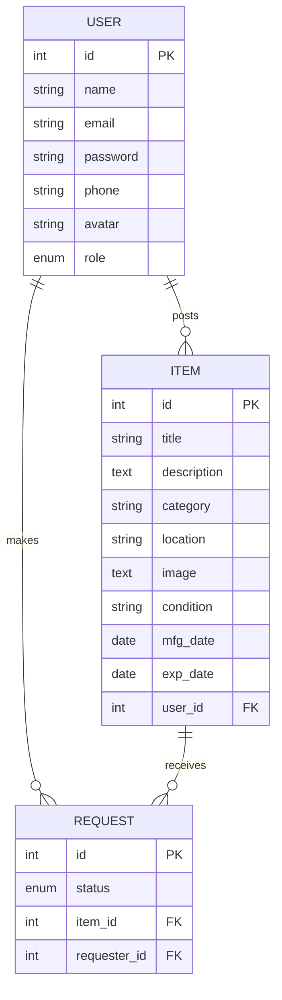

# ReValue Hub — Final Year Project Proposal

## 1. Introduction

ReValue Hub is a web-based reuse marketplace designed to connect users who want to share or request pre-owned items within a local community. The application supports user registration, item posting, item browsing, request management, and administrative control. It is built using Node.js, Express, Sequelize, and MariaDB, with a responsive front-end based on static HTML pages.

This proposal presents the problem context, objectives, literature background, research methodology, and the database design needed to deliver a complete Final Year Project.

## 2. Problem Statement

Modern consumption patterns generate a large amount of reusable goods that are prematurely discarded. Many individuals and communities lack a simple, secure platform to offer these items to others, leading to avoidable waste.

Key issues addressed by this project:
- Lack of centralized local systems for sharing or requesting used items.
- Poor management of item requests and verification for shared goods.
- Insufficient support for both regular users and administrators in item lifecycle tracking.
- Absence of an integrated database design to manage users, listings, and requests efficiently.

## 3. Aims and Objectives

### Aim
To design and implement ReValue Hub, a secure community platform for listing reusable items, managing requests, and facilitating reuse through a robust database-backed web application.

### Objectives
1. Build a user authentication system with role-based access for regular users and admins.
2. Implement item posting, editing, and browsing functionality for reusable goods.
3. Enable request creation, tracking, and approval workflows.
4. Develop an administrative dashboard for monitoring users, items, and requests.
5. Create a relational database schema with clear entity relationships and persistence using MariaDB and Sequelize.
6. Validate the solution through testing, demonstration, and user-flow evaluation.

## 4. Literature Review

The design of ReValue Hub is informed by research into sharing economy platforms, reuse marketplaces, and community exchange systems.

- Reuse and sharing platforms help reduce waste and support circular economy principles by extending the life of products. Prior studies show that online peer-to-peer marketplaces can improve resource efficiency and decrease environmental impact.
- Existing classified-listing and donation systems emphasize trust, access control, and clear request handling. Lessons from these systems guided the need for user authentication, item metadata, and request statuses.
- Research on database-backed applications highlights the importance of normalized schemas to prevent redundancy and maintain consistency, especially for user-generated content and transactional workflows.
- The use of MVC-style architecture and RESTful APIs in modern web apps supports scalability and maintainability, which aligns with the planned Node.js + Express implementation.

## 5. Research Methodology

### 5.1 Requirements Gathering
- Review functional requirements: account creation, login/logout, item posting, item search, request submission, and admin oversight.
- Identify non-functional requirements: security, data consistency, maintainability, and usability.

### 5.2 System Design
- Define the application architecture with separate layers for routing, controllers, models, and static content.
- Model the database entities and their relationships using Sequelize and MariaDB.

### 5.3 Implementation
- Develop the backend with Node.js, Express, Sequelize, and MariaDB.
- Implement authentication using JWT and password hashing.
- Create the front-end interface using static HTML pages, forms, and client interactions served by the Express server.
- Add file upload support for item images and route protection for secure operations.

### 5.4 Testing and Evaluation
- Perform unit and integration testing for API endpoints and database operations.
- Validate user flows for registration, login, posting items, requesting items, and admin actions.
- Collect feedback by demonstrating the application and confirming expected behavior.

### 5.5 Deployment and Documentation
- Provide database setup instructions for MariaDB and environment configuration.
- Document the application structure, setup process, and usage scenarios.

## 6. Database ERD Diagram

## 7. Expected Outcomes

- A functioning ReValue Hub prototype capable of managing users, listings, and requests.
- A normalized database schema that supports clean relationships between users, items, and requests.
- A professional project deliverable suitable for FYP assessment, including all design, implementation, and documentation components.

## 8. Conclusion

ReValue Hub aims to provide a practical solution for reuse and sharing within a local community. By combining a clear database design, secure user workflows, and administrative oversight, the project addresses real-world waste reduction challenges while delivering a complete software prototype for the final year project.
