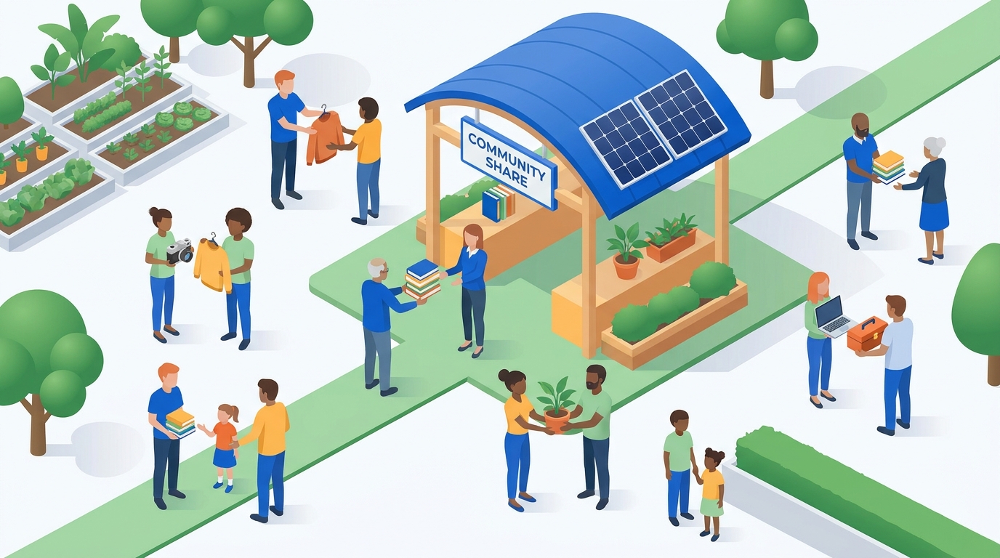
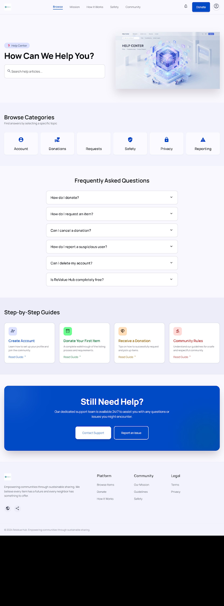

# ReValue Hub — User Manual

> **For non-technical users.** This guide walks you through every feature of ReValue Hub, step by step.

---

## 1. What is ReValue Hub?

ReValue Hub is a community marketplace where neighbors give away items they no longer need and request items they *do* need — all for free. Think of it as a digital "freecycling" platform for your local area. You can donate furniture, electronics, books, tools, clothes, and more. Every item re-homed is one less item in a landfill.

---

## 2. Creating an Account / Signing In

### 2.1. Register a new account

1. Open your browser and go to `http://localhost:3000`.
2. Click **Create Free Account** on the landing page, or go directly to `register.html`.
3. Fill in the form:
   - **Full Name** — your first and last name (e.g. "Alex Johnson").
   - **Email Address** — a valid email you have access to.
   - **Password** — at least 6 characters.
4. Check the box **"I agree to the Terms of Service and Privacy Policy"**.
5. Click the **Create Account** button.

After a successful registration, you will be automatically logged in and taken to your **Dashboard**. Your token is stored in the browser so you stay logged in until you sign out.

> **What if I leave a field empty?** The page will show an alert reminding you to fill in all required fields. No data is sent to the server until all fields are complete.

### 2.2. Sign in to an existing account

1. Open `login.html` (or click **Sign in instead** from the registration page).
2. Enter the **Email Address** and **Password** you registered with.
3. Click the **Sign In** button.

If your credentials are correct, you will be sent to your **Dashboard**. If you enter the wrong password, you will see an error message.

### 2.3. Signing out

Click the **Logout** button (found in the sidebar of your Dashboard, or the profile popup in the header). You will be taken back to the landing page.

---

## 3. Browsing and Searching Items

1. Click **Browse** in the top navigation bar, or go to `browse.html`.
2. All available items are displayed as cards in a grid. Each card shows:
   - A photo of the item.
   - The item's title and location.
   - The donor's name and avatar.
   - A **View** button.
3. **Search by keyword** — type in the search box at the top of the page. The item grid updates as you type, showing only items whose title matches your search.
4. **Filter by category** — use the sidebar on the left. Click a category like **Furniture**, **Electronics**, or **Tools** to see only items in that category. The active category is highlighted in blue.
5. **Combine filters** — you can search by keyword and select a category at the same time.
6. **Reset filters** — click the **Reset Filters** button at the bottom of the sidebar to clear all filters and show every item again.

> **Note:** You do not need an account to browse items. However, if you are not logged in, clicking on an item will redirect you to the registration page first.

---

## 4. Viewing an Item's Details

Click any item card from the browse page (or from the Dashboard) to open the item details page (`item-detail.html?id=...`). This page shows:

- **Large photo** of the item (with thumbnail previews if multiple images exist).
- **Category badge** and **condition** (e.g. "Good", "Like New").
- **Item title** and **full description**.
- **Donor profile card** — shows the donor's name, avatar, and a "Verified Donor" badge.
- **Pick-up location** — a general area (exact address is shared after a request is accepted). A map is displayed if a location was provided.
- **Item details** list — condition, posted date, and brand/color if available.

### What you can do on this page depends on who you are:

| Your relationship to the item | What you see |
|-------------------------------|-------------|
| **The donor (owner)** — you listed this item | The **Request Item** and **Message Donor** buttons are hidden. An **Edit Item** button appears instead, letting you edit the listing. |
| **Another user** — someone else listed it | You see **Request Item** and **Message Donor** buttons. The **Edit Item** button is hidden. |
| **Not logged in** | You are redirected to the registration page. |

---

## 5. Requesting an Item

When you find an item you'd like to claim:

1. Open the item's detail page (`item-detail.html?id=...`).
2. Click the blue **Request Item** button.
3. A request is sent to the item's donor for approval.

If the request is successful, you will see an alert saying **"Request sent successfully!"**. The donor will see your request in their Dashboard and can choose to **approve** or **reject** it.

### Important rules

- **You cannot request your own item.** The button is hidden if you are looking at something you donated.
- **You cannot request the same item twice.** If you have already requested an item, the system will block a duplicate request.
- **You must be logged in.** If you are not logged in, clicking the button will redirect you to the registration page.

---

## 6. Messaging a Donor

If you want to ask a question about an item before requesting it, you can send the donor a direct message.

### From the item detail page

1. Open the item's detail page.
2. Click the **Message Donor** button.
3. A pop-up window appears with a text area.
4. Type your message (e.g. "Hi! Is this chair still available? I can pick it up this weekend.").
5. Click **Send Message**.

After sending, you are taken to the **Messages** page where you can continue the conversation.

> **You cannot message yourself.** If you open your own item, the Message Donor button is hidden.

### Using the Messages inbox

1. Open `messages.html`.
2. The left sidebar shows all your conversations, each with:
   - The other person's name and avatar.
   - A preview of the latest message.
   - The time it was sent.
   - A badge showing unread message count.
3. Click a conversation to open it in the right pane.
4. Type a new message in the text area at the bottom and press **Enter** (or click the send icon).
5. Your sent messages appear in blue bubbles on the right. Incoming messages appear in gray bubbles on the left.
6. The conversation refreshes automatically every few seconds so you can see new replies.

> **Must be logged in:** If you open `messages.html` without being logged in, you will be redirected to the registration page.

---

## 7. Listing (Donating) an Item

Got something you no longer need? Here's how to list it for donation:

1. Click the **Donate** button in the top navigation bar, or go to `list-item.html`.
2. **Section 1: Item Details**
   - **Item Title** — give your item a clear, descriptive name (e.g. "IKEA Malm Dresser").
   - **Category** — choose from the dropdown: Furniture, Electronics, Clothing, Home & Kitchen, Books & Media, Medicine, Health, or Other.
   - **Description** — describe the item's condition, dimensions, and any unique features.
   - If you selected **Medicine**, two extra date fields appear: **Manufacturing Date** and **Expiry Date**.
3. **Section 2: Upload Photos**
   - Drag and drop images onto the upload area, or click **Browse Files** to select them from your computer.
   - You can upload up to **10 images**. Supported formats: JPEG, PNG, WebP, GIF.
   - Each image must be under **10 MB**.
   - Hover over a preview image and click the trash icon to remove it.
4. **Section 3: Pickup Details**
   - **Approximate Location** — enter a general area (e.g. "Brooklyn, NY"). Your exact address is not shown; only the general area is visible until a request is accepted.
5. Click **Publish Listing** at the bottom.
6. If successful, you'll see an alert and be redirected to your **Dashboard**, where the new item appears in the **My Donations** section.

> **Must be logged in:** If you are not logged in, you will be redirected to the registration page. After creating an account, you will be sent back to the listing form.

---

## 8. Managing Your Listings from Your Dashboard

Your Dashboard (`dashboard.html`) is your command center. It has several sections accessible from the left sidebar:

### Dashboard (Overview)
The home section shows a welcome message, summary cards (Total Items Donated, Active Requests, Impact Points), and a **Recent Activity** table.

### My Donations
Click **My Donations** in the sidebar to see all the items you have listed. Each item card shows:
- A photo.
- The item title and location.
- A **Details** button (click to view the item detail page).
- A **delete** button (trash icon) — click it to permanently remove the listing. A confirmation dialog appears first.

At the bottom of the grid there is a **"List New Item"** placeholder card — click it to go to the donation form.

### My Requests
Click **My Requests** to see all the items you have requested from other members. Each entry shows:
- The item's title.
- The request status: **pending** (yellow), **approved** (green), or **rejected** (red).
- The date you requested it.
- A **Details** link to view the item.

### History
Shows a chronological list of all your activities (donations and requests) with their statuses and dates.

### Settings (Profile)
See section 9 below.

### Logout
Click **Logout** at the bottom of the sidebar to sign out.

---

## 9. Editing Your Profile

1. Go to your Dashboard (`dashboard.html`) and click **Settings** in the left sidebar.
2. The **Profile Settings** panel shows:
   - Your **avatar** (profile picture) — click the camera icon overlay to upload a new photo.
   - Your **Name** — edit this field to change your display name.
   - Your **Email** — edit this field to change your email address.
3. Click **Save Changes**.
4. A green "Profile updated" message appears briefly to confirm.

The changes take effect immediately — your name and avatar update across the site (header, dashboard, item cards, etc.).

> **Note about avatar upload:** You can upload a JPEG, PNG, WebP, or GIF file up to 5 MB. After selecting a file, you see a preview before saving.

---

## 10. Notifications

The bell icon  in the top navigation bar shows your notifications. A red badge on the bell indicates unread notifications.

### Viewing notifications

1. Click the bell icon.
2. A pop-up panel appears showing recent notifications, each with:
   - An icon indicating the type (message, request, system).
   - The notification message text.
   - The time it was received.
   - A blue dot if it is unread.
3. The top of the panel shows how many new (unread) notifications you have.

### Marking notifications as read

- Click on an individual notification to mark it as read.
- Click **"Mark all as read"** at the bottom of the panel to clear all unread badges at once.
- If a notification contains a message, clicking it takes you directly to the Messages page.

### Automatic checking

The system checks for new notifications every 30 seconds. When a new notification arrives while you are browsing, a toast message slides in at the bottom-right corner of the screen. Click the toast to go to the Messages page.

---

## Need Help?

Visit these pages for more information:

- [How It Works](how_it_works.html) — `how_it_works.png`
- [Help Center](help_center.html) — `help_center.png`
- [Contact Us](contact_us.html) — `contact_us.png`
- [Report an Issue](report_an_issue.html) — `report_an_issue.png`
- [Community Guidelines](community_guidelines.html) — `community_guidelines.png`
- [Safety Center](safety_center.html) — `safety_center.png`

